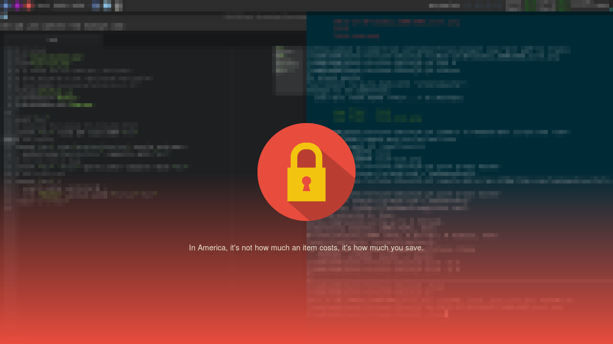

# fortune-i3lock
### A simple bash script that makes i3lock look a bit nicer

This script creates a lock screen each time when activated, which has a
different quote each time, which is done by using `fortune`

When the lock screen comes up just type your password and hit enter, nothing
will come up while you are typing the password unless you remove the -u flag
from i3lock in the script

Dependencies:
* imagemagick
* scrot
* i3lock
* fortune
