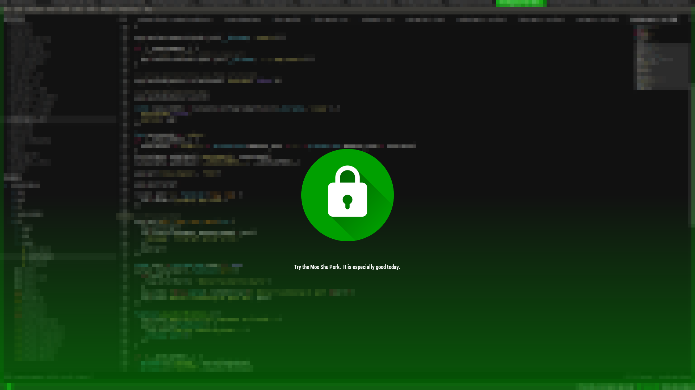

# fortune-i3lock
### A simple bash script that makes i3lock look a bit nicer

This script creates a lock screen each time when activated, which has a
different quote each time, which is done by using `fortune`

When the lock screen comes up just type your password and hit enter, nothing
will come up while you are typing the password unless you remove the -u flag
from i3lock in the script

Dependencies:
* imagemagick
* scrot
* i3lock
* fortune

### Customization

[Material Design based](https://material.io/icons/#ic_lock) (and easily colorable) icon added by [RanzQ](https://github.com/RanzQ) (CC BY).

For custom color, change the fill of the svg circle (`md-lock-icon.svg` line 42) and convert it to png ([inkscape](https://inkscape.org/en/) is useful).

Font here is `RobotoCondensed-Bold` from `fonts-roboto` and for transparent colors use `rgba()` (eg. `gradientColor='rgba(0,160,0,0.5)'`).
